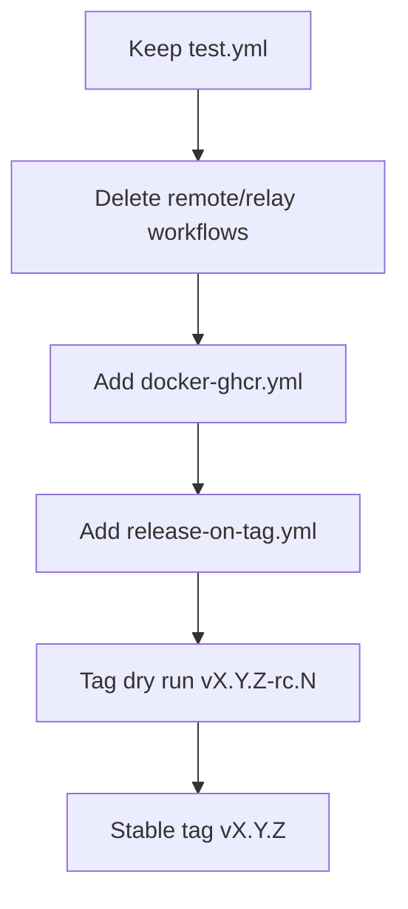

# Fork-First CI/CD Design

## Goals
- Keep CI validation for PRs and `main` pushes.
- Release from semver tags (`v*`) using GitHub Releases.
- Publish `vibe-kanban` Docker image to private GHCR.
- Eliminate upstream-only workflows/secrets (remote/relay dispatch, R2, npm publish, Apple notarization, etc.).

## Keep As-Is (or nearly as-is)
- Keep CI workflow: [D:/Git/vibe-kanban/.github/workflows/test.yml](D:/Git/vibe-kanban/.github/workflows/test.yml)
  - Continue running `frontend-checks`, `backend-schema-checks`, `backend-clippy`, `backend-test`, `tauri-checks`.
  - Delete `backend-remote-checks` job in fork (it depends on `VK_PRIVATE_DEPLOY_KEY`).

## Retire Upstream-Coupled Workflows
- Delete remote + relay workflows that depend on hardcoded external deployment repo and repository dispatch:
  - [D:/Git/vibe-kanban/.github/workflows/remote-deploy-dev.yml](D:/Git/vibe-kanban/.github/workflows/remote-deploy-dev.yml)
  - [D:/Git/vibe-kanban/.github/workflows/remote-deploy-prod.yml](D:/Git/vibe-kanban/.github/workflows/remote-deploy-prod.yml)
  - [D:/Git/vibe-kanban/.github/workflows/remote-release.yml](D:/Git/vibe-kanban/.github/workflows/remote-release.yml)
  - [D:/Git/vibe-kanban/.github/workflows/relay-deploy-dev.yml](D:/Git/vibe-kanban/.github/workflows/relay-deploy-dev.yml)
  - [D:/Git/vibe-kanban/.github/workflows/relay-deploy-prod.yml](D:/Git/vibe-kanban/.github/workflows/relay-deploy-prod.yml)
  - [D:/Git/vibe-kanban/.github/workflows/relay-release.yml](D:/Git/vibe-kanban/.github/workflows/relay-release.yml)

## Replace Release Pipeline
- Replace heavy pre-release/publish orchestration with a fork-focused release flow:
  - Delete obsolete upstream-coupled release workflows:
    - [D:/Git/vibe-kanban/.github/workflows/pre-release.yml](D:/Git/vibe-kanban/.github/workflows/pre-release.yml)
    - [D:/Git/vibe-kanban/.github/workflows/publish.yml](D:/Git/vibe-kanban/.github/workflows/publish.yml)
  - Add `release-on-tag.yml`:
    - Trigger: `on.push.tags: ['v*']`.
    - Verify tag looks semver-compatible.
    - Create/update GitHub Release for tag.
    - Optionally attach lightweight build artifacts if needed (`dist` zip only, no npm/R2/Tauri updater paths).

## Add GHCR Docker Publish Workflow
- Add `docker-ghcr.yml` workflow for private image publication:
  - Triggers:
    - `push` on `main` (snapshot tags)
    - `push.tags` on `v*` (release tags)
    - optional `workflow_dispatch`
  - Permissions:
    - `contents: read`
    - `packages: write`
  - Steps:
    - `actions/checkout`
    - `docker/setup-buildx-action`
    - `docker/login-action` to `ghcr.io` with `${{ github.actor }}` + `${{ secrets.GITHUB_TOKEN }}`
    - `docker/metadata-action` for tags (`sha`, branch, semver tag, optional `latest`)
    - `docker/build-push-action` using root [D:/Git/vibe-kanban/Dockerfile](D:/Git/vibe-kanban/Dockerfile)
  - Image target:
    - `ghcr.io/${{ github.repository_owner }}/vibe-kanban`

## Repository/Org Settings to Apply
- In repo Actions settings, keep workflow permissions allowing package writes for GHCR jobs.
- Set GHCR package visibility to private after first push (or ensure org policy enforces private packages).
- Keep only required secrets for your forked build path; remove references to unused upstream secrets.

## Validation Plan
- PR to workflow branch:
  - Confirm `test.yml` passes without relay/remote dependencies.
- Push `vX.Y.Z-rc.N` test tag:
  - Confirm tag workflow builds and pushes private GHCR image.
- Push stable `vX.Y.Z`:
  - Confirm GitHub Release creation and final semver image tags.
- Pull/run smoke test:
  - `docker run -p 3000:3000 ghcr.io/<owner>/vibe-kanban:<tag>` and verify `/health`.

## Rollout Sequence

